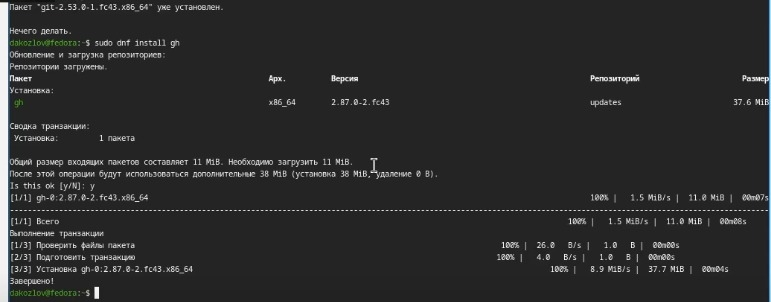
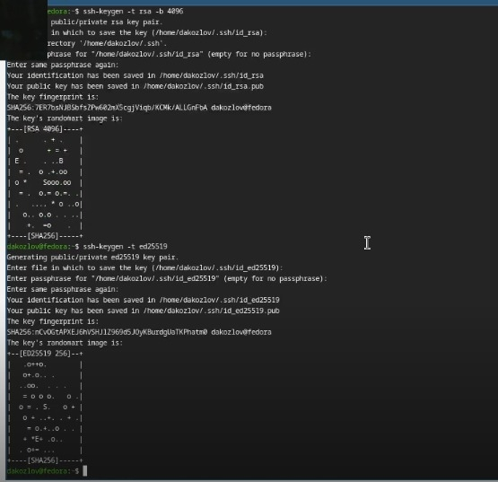
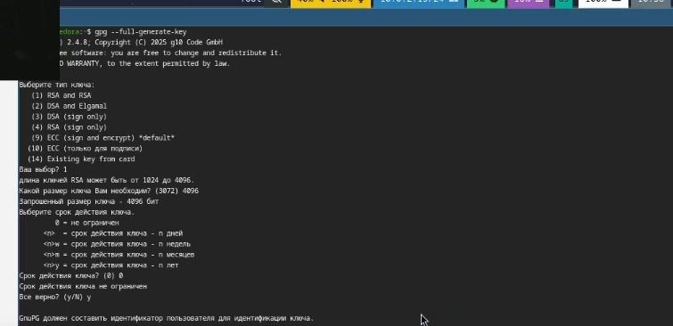
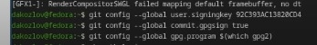
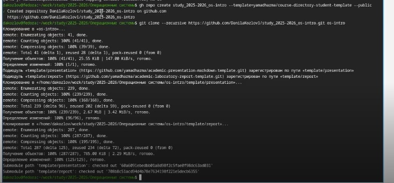

# Лабораторная работа №2 Первоначальная настройка git

**Студент:** Козлов Данила
**Дата:** 04.03.2026

## Цель работы

Изучить идеологию и применение средств контроля версий.
Освоить умения по работе с git.

## Задание

- Создать базовую конфигурацию для работы с git
- Создать ключ SSH
- Создать ключ GPG
- Настроить подписи git.
- Создать локальный каталог для выполнения заданий по предмету.

## Выполнение лабораторной работы

### 1. Установка git и gh
Пишем следующие команды:
dnf install git
dnf install gh

### 2.Базовая настройка git
Пишем следующие команды:
git config --global user.name "Danila Kozlov"
git config --global user.email "danilakozlov11@tutamail.com"
git config --global core.quotepath false
git config --global init.defaultBranch master
git config --global core.autocrlf input
git config --global core.sagecrlf warn

### 3.Создание SSH-ключей
Пишем следующие команды:
ssh-keygen -t rsa -b 4096
ssh-keygen -t ed25519

### 4. Создание GPG-ключа
gpg --full-generate-key

### 5. Настройка автоподписи коммитов
Пишем следующие команды:
git config --global user.signingkey
git config --global commit.gpgsign true
git config --global gpg.program $(which gpg2)

### 6. Создание репозитория курса
Пишем следующие команды:
mkdir -p ~/work/study/2025-2026/"Операционные системы"
cd ~/work/study/2025-2026/"Операционные системы"
gh repo create study_2025-2026_os-intro --template=yamadharma course-directory-student-template --public
git clone --recursive https://github.com/DanilaKozlov1/study_2025-2026-2026_os-intro.git os-intro

## Выводы

В ходе выполнения лабораторной работы была изучена идеология систем контроля версий. Освоена работа с git: настройка, создание SSH и GPG ключей, подпись коммитов,
создание репозитория на GitHub.
