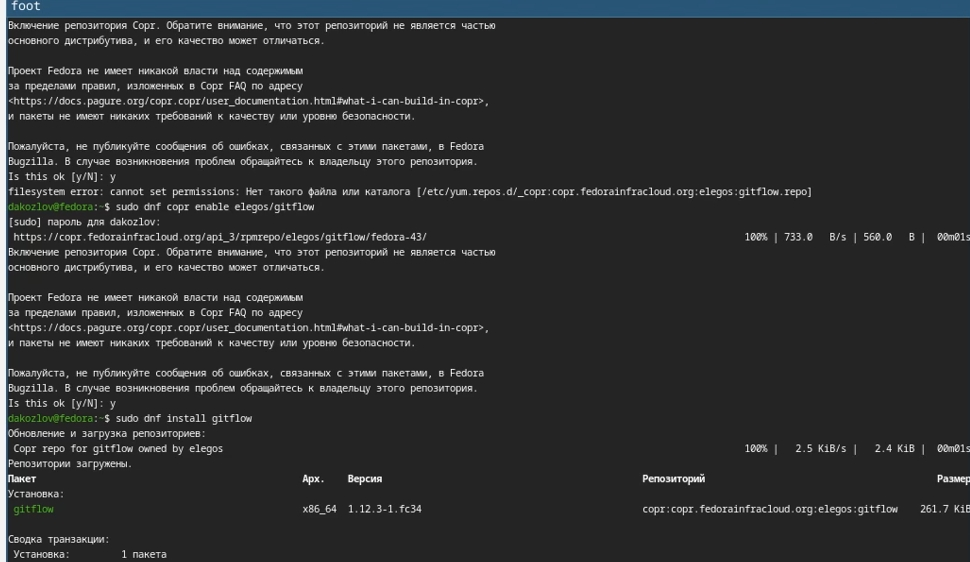
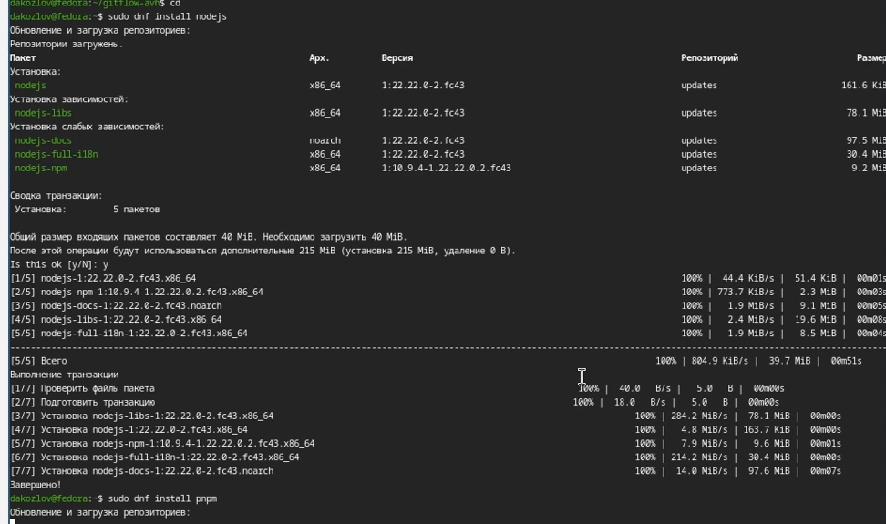
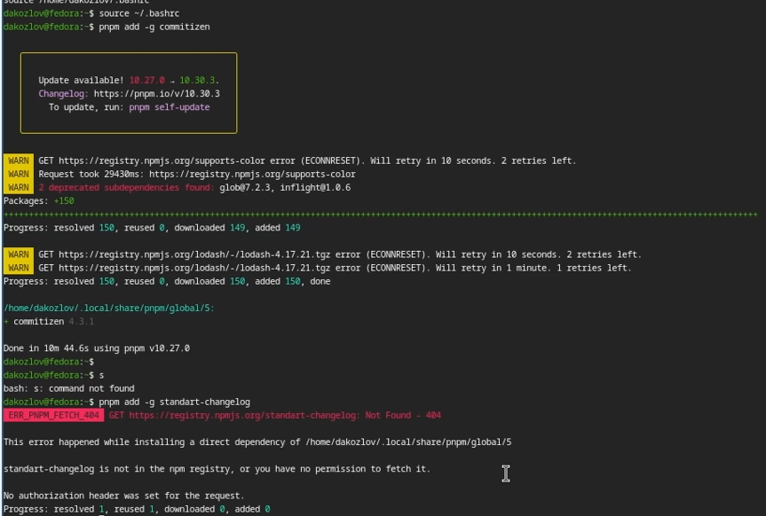
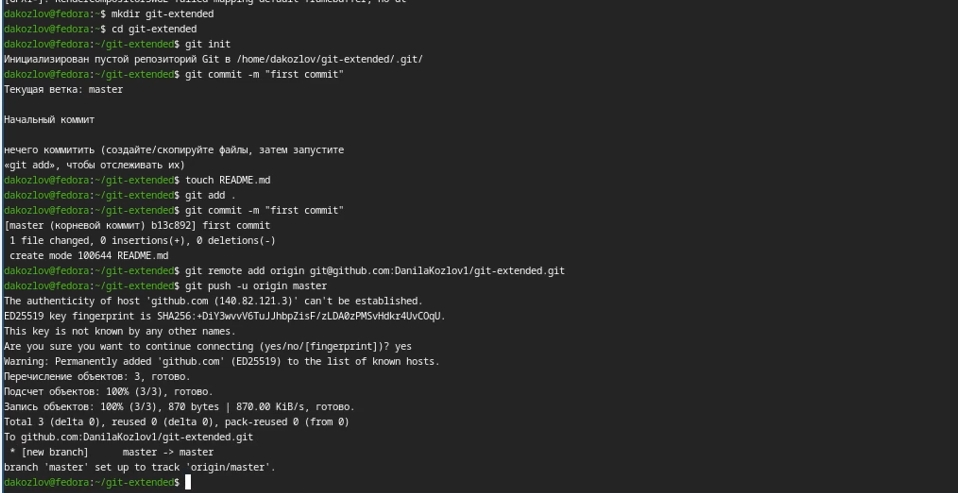
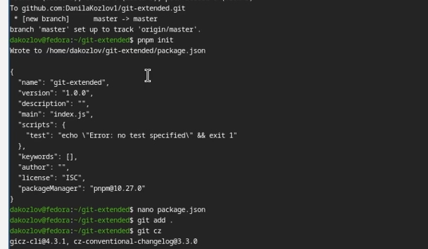
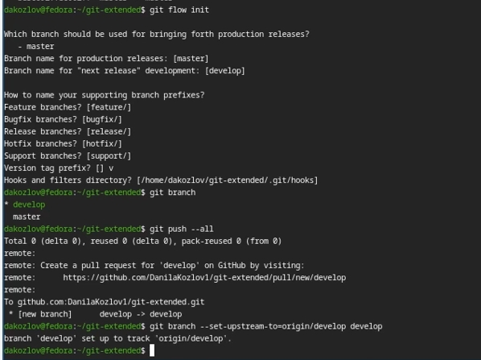
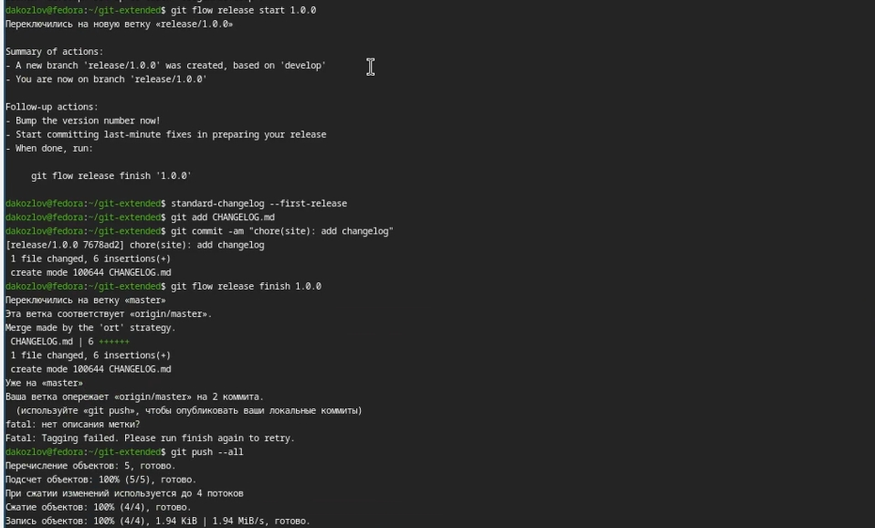
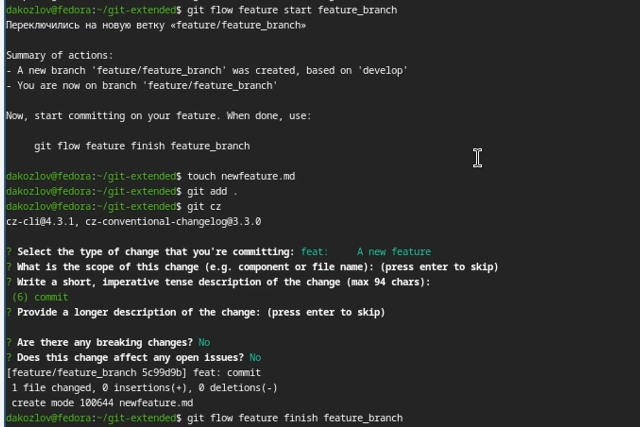
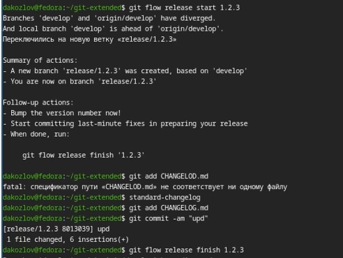

---
author:
  name: Козлов Данила
  email: danilakozlov11@mail.com
  affiliation:
    - name: Российский университет дружбы народов
      country: Российская Федерация
      city: Москва

title: "Лабораторная работа №4. Продвинутое использование git"
subtitle: "Архитектура компьютеров и операционные системы"
license: "CC BY"
---

# Цель работы

Получение навыков правильной работы с репозиториями git.

# Задание

- Выполнить работу для тестового репозитория.
- Преобразовать рабочий репозиторий в репозиторий с git-flow и conventional commits.

# Выполнение лабораторной работы

## 1. Установка git-flow
```bash
dnf copr enable elegos/gitflow
dnf install gitflow
```



## 2. Установка и настройка Node.js
```bash
dnf install nodejs
dnf install pnpm
pnpm setup
source ~/.bashrc
```



## 3. Установка commitizen и standard-changelog
```bash
pnpm add -g commitizen
pnpm add -g standard-changelog
```



## 4. Создание репозитория git-extended
```bash
mkdir git-extended
cd git-extended
git init
git commit -m "first commit"
git remote add origin git@github.com:DanilaKozlov1/git-extended.git
git push -u origin master
```



## 5. Конфигурация общепринятых коммитов

Инициализировал package.json командой `pnpm init` и добавил конфигурацию commitizen.



## 6. Инициализация git-flow
```bash
git flow init
git push --all
git branch --set-upstream-to=origin/develop develop
```



## 7. Создание релиза 1.0.0
```bash
git flow release start 1.0.0
standard-changelog --first-release
git add CHANGELOG.md
git commit -am 'chore(site): add changelog'
git flow release finish 1.0.0
git push --all
git push --tags
gh release create v1.0.0 -F CHANGELOG.md
```



## 8. Разработка новой функциональности
```bash
git flow feature start feature_branch
git flow feature finish feature_branch
```



## 9. Создание релиза 1.2.3
```bash
git flow release start 1.2.3
standard-changelog
git add CHANGELOG.md
git commit -am 'chore(site): update changelog'
git flow release finish 1.2.3
git push --all
git push --tags
gh release create v1.2.3 -F CHANGELOG.md
```



# Выводы

В ходе выполнения лабораторной работы были получены навыки
правильной работы с репозиториями git. Освоен рабочий процесс
Gitflow, семантическое версионирование и общепринятые коммиты.
